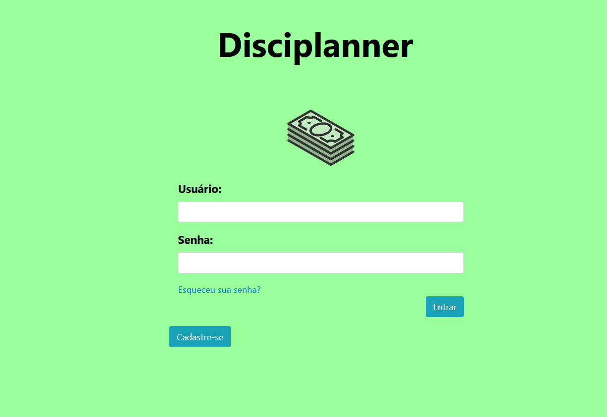
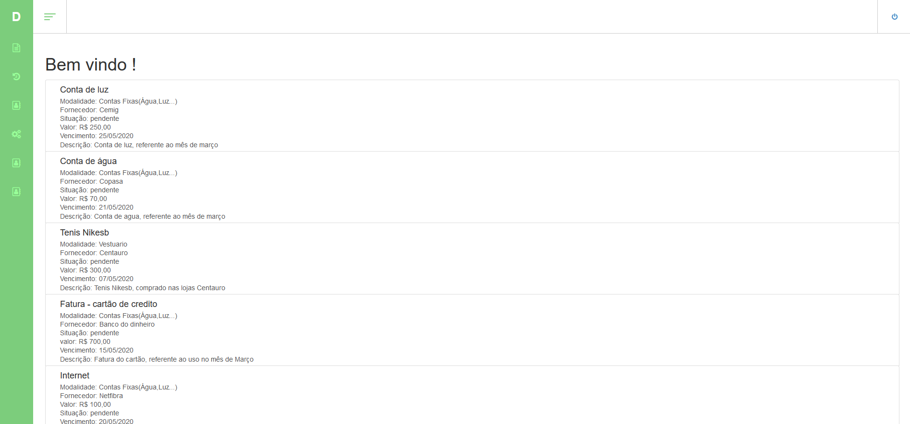
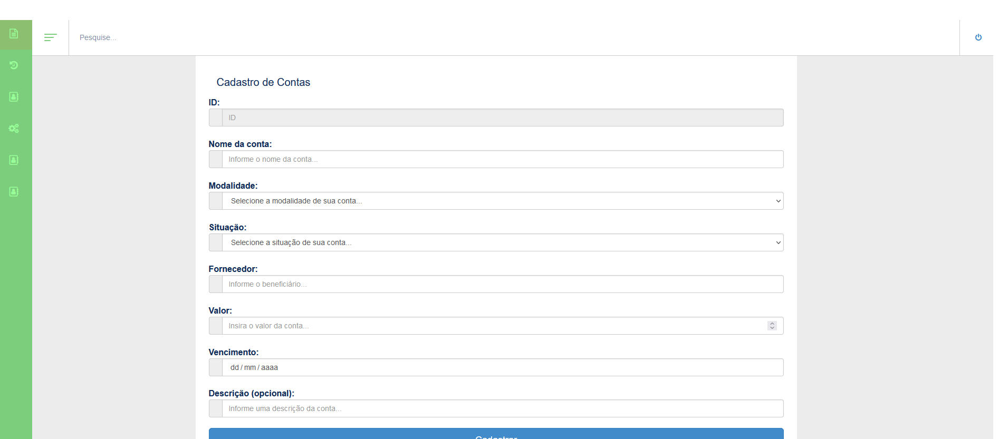

# Disciplanner
Um trabalho em grupo de faculdade do primeiro péríodo da matéria Trabalho Interdisciplinar: Aplicações Web.
Consiste em um pequeno sistema capaz de cadastrar desespesas e visualiza-las em forma de tabela ou gráfico.
Feito para auxiliar na administração financeira de cada usuário.

## Tecnologias 
- HTML, CSS & JavaScript.

## Imagens
#### Tela de Login

####Tela Inicial

####Tela de Cadastro de Contas

